<!--
**PathToLife/pathtolife** is a ✨ _special_ ✨ repository because its `README.md` (this file) appears on your GitHub profile.

Here are some ideas to get you started:

- 🔭 I’m currently working on ...
- 🌱 I’m currently learning ...
- 👯 I’m looking to collaborate on ...
- 🤔 I’m looking for help with ...
- 💬 Ask me about ...
- 📫 How to reach me: ...
- 😄 Pronouns: ...
- ⚡ Fun fact: ...
-->

### Hi there 👋 I'm PathToLife, a Software Engineer / Computer Scientist, more the former.

Here are my projects (at least public ones) and OpenSource Projects where I'm a code contributor across Full Stack, Data Science, Native Applications, and IoT Devices. I tinker with new tech all the time!

I also love travelling, hiking, and space!

🔭 I’m currently working on... a project that we might release after :)

Simple code is friendly to everyone, picking a well trodden path.. most of the time :)
